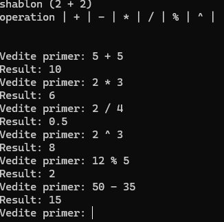

# cpp-calculator

My first console calculator in C++.

## Операции

| Символ | Описание |
|--------|----------|
| `+` | Сложение |
| `-` | Вычитание |
| `*` | Умножение |
| `/` | Деление |
| `%` | Остаток от деления |
| `^` | Возведение в степень |

## Пример работы

